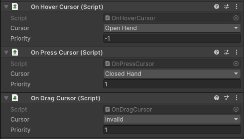

# UI Components



## OnHoverCursor

Once the cursor is over the component, the cursor will change to the given cursor.
If multiple components are hovered, the cursor will be the one with the highest priority.

## OnPressCursor

Once the component is pressed, the cursor will change to the given cursor.
If multiple components are pressed, the cursor will be the one with the highest priority.

## OnDragCursor

Once the component is dragged, the cursor will change to the given cursor.
If multiple components are dragged, the cursor will be the one with the highest priority.

## UI Toolkit

For UI Toolkit, use `CursorManipulator` from code:

```c#
button.AddNativeCursor(NTCursors.Link);
resizeHandle.AddNativeCursor(NTCursors.ResizeHorizontal, UIToolkitCursorTrigger.Drag);
```

You can also add `UIToolkitCursorBinder` to a `UIDocument` GameObject and bind cursor entries by element name or USS class.
